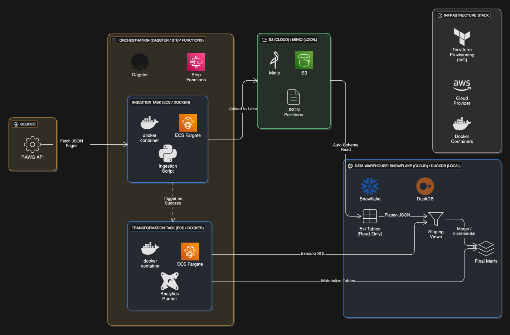

# 🏗️ System Architecture

This document outlines the architectural patterns used in the Game Market Pipeline. The system follows a **Lambda Architecture** approach, designed for fault tolerance and hybrid execution.

## High-Level Design

## Core Concepts

### 1. Idempotent Ingestion ("Smart Resume")
The ingestion pipeline is designed to be crash-resilient.
*   **Problem:** API rate limits are strict. If a job crashes at page 99 of 100, retrying from page 1 wastes credits and money.
*   **Solution:** The `S3Writer` class performs a `HEAD` request against S3 before fetching data.
*   **Logic:** `if exists(s3_path): skip() else: fetch()`.
*   **Result:** The pipeline can be run 100 times in a row with zero cost after the first successful run.

### 2. Single Source of Truth (SSOT) Configuration
We avoid "Magic Strings" hardcoded in multiple languages.
*   **File:** `config/endpoints.json` contains the master list of API endpoints (`games`, `genres`, etc.).
*   **Consumers:**
    *   **Python:** Reads this file to determine which API routes to hit.
    *   **Terraform:** Reads this file to generate the AWS Step Functions Parallel Map state.
    *   **Dagster:** Reads this file to generate Local Assets.
*   **Benefit:** Adding a new data source requires editing only **one** file.

### 3. Hybrid Orchestration
To balance cost vs. experience, we use different orchestrators for different environments:

| Feature | Local (Dagster) | Cloud (Step Functions) |
| :--- | :--- | :--- |
| **Cost** | Free (Docker) | Free Tier (Serverless) |
| **Logic** | Asset-based dependencies | JSON State Machine |
| **Trigger** | Cron Schedule | EventBridge (Cron) |
| **Exec** | Local Container | AWS Fargate |

### 4. Hybrid Storage Abstraction
*   **Ingestion Layer:** The `S3Writer` class detects the environment. If `S3_ENDPOINT` is present, it targets MinIO. If absent, it targets AWS S3.
*   **Warehouse Layer:** dbt uses `profiles.yml` to switch adapters.
    *   **Dev:** `dbt-duckdb` (reads JSON from MinIO).
    *   **Prod:** `dbt-snowflake` (reads JSON from S3 External Tables).