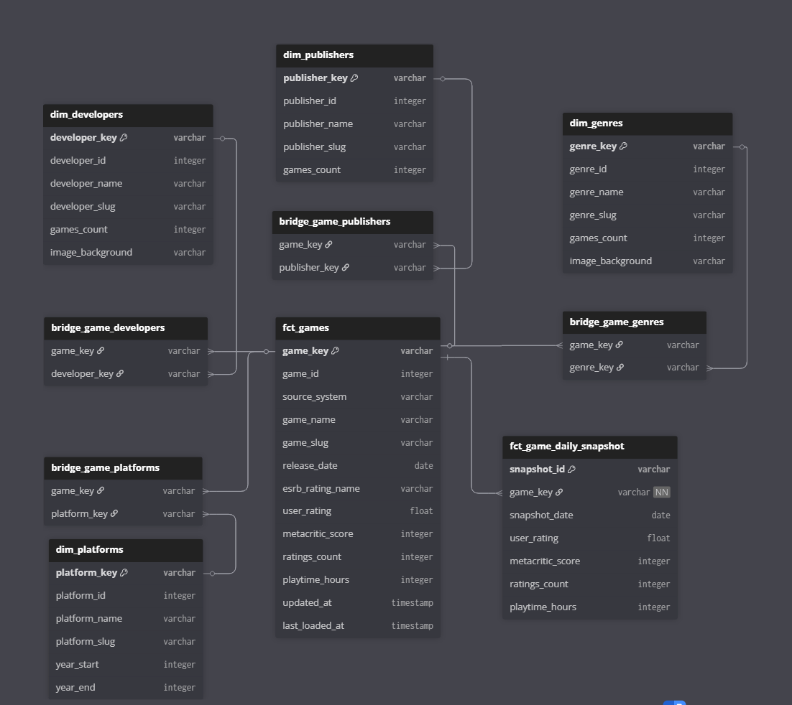

# 📊 Data Warehouse & Analytics 

The Data Warehouse is designed for **Schema-on-Read** flexibility and **High-Performance Merging**.

## Layered Architecture

### 1. Raw Layer (External Tables & Partitioning)
*   **Technology:** Snowflake External Tables.
*   **Optimization:** We use **Partition Pruning**.
    *   S3 Path: `s3://bucket/raw/games/run_date=2024-01-01/file.json`
    *   Snowflake Definition: `PARTITION BY (ingestion_date)`
*   **Benefit:** When dbt runs for a specific day, Snowflake scans **only** that day's folder, not the entire bucket.

### 2. Marts Layer (Incremental Strategy)
We use a **Natural Key** strategy for incremental loads to optimize for Snowflake's micro-partitions.

*   **Problem:** Merging on Hash Keys (`MD5(id)`) causes full table scans because hashes are randomly distributed across micro-partitions.
*   **Solution:** We configure dbt to merge on Natural Keys (`game_id`).
    *   `unique_key = ['game_id', 'source_system']`
*   **Result:** Since IDs correlate with time/insertion order, Snowflake can prune 90%+ of the micro-partitions during the merge, significantly reducing costs.

## Data Quality (Contracts)

We enforce quality at the warehouse level using `schema.yml` constraints.
*   **Uniqueness:** Primary keys must be unique.
*   **Not Null:** Critical business keys cannot be null.
*   **Domain Validity:** Example: `user_rating` must be between 0 and 5.

